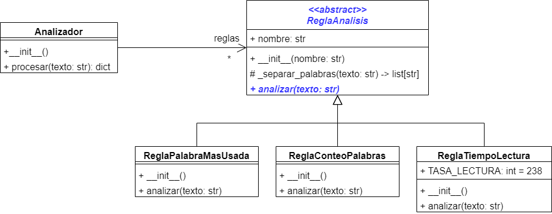

# Ejercicio Analizador de Texto
Para este ejercicio vas a suponer que trabajas para un proyecto donde te asignan la
tarea de construir un analizador de texto que ayude a obtener información sobre el texto
que escriben los autores de blogs.

Para el diseño del analizador se definieron las siguientes tres reglas para el análisis.

## 1. Palabras más usadas
Esta regla debe analizar el texto y devolver una lista con las 10 palabras más usadas. Este
análisis debe tener en cuenta lo siguiente:

- No se debe diferenciar entre mayúsculas y minúsculas. Por ejemplo, las palabras "usted" y
"Usted" deben contar como la misma palabra.
- En el listado deben aparecer primero las palabras con mayor frecuencia, sin embargo, no 
existe un orden específico para listar las palabras que tengan la misma frecuencia.

> ### Ejemplo
> Dado el siguiente texto para analizar:
> 
> ***Hola, este es un ejemplo para que usted practique. Usted puede tomar este texto y
> usarlo como su caso de prueba.***
> 
> El resultado del análisis de palabras más usadas debería ser
> 
> 1. este
> 2. usted
> 3. hola
> 4. es
> 5. un
> 6. ejemplo
> 7. para
> 8. que
> 9. practique
> 10. puede
> 
> En este caso, también podría aparecer primero ***usted*** que ***este***, ya
> que ambas palabras aparecen dos veces en el texto

## 2. Conteo de palabras
Esta regla debe analizar el texto e indicar cuántas palabras contiene, sin importar
si son palabras repetidas.

> ### Ejemplo
> Dado el siguiente texto para analizar:
> 
> ***Hola, este es un ejemplo para que usted practique. Usted puede tomar este texto y
> usarlo como su caso de prueba.***
> 
> El resultado del análisis debería indicar que el texto tiene ***21*** palabras.

## 3. Tiempo de lectura
Esta regla debe analizar el texto e indicar cuánto tiempo le tomaría a un usuario
leerlo. Para esto se debe tener en cuenta lo siguiente:

- La tasa promedio de lectura es de ***238*** palabras por minuto
- Se obtiene el total de palabras del texto
- Se divide el total de palabras por 238 y la parte entera de esa división son los minutos.
- Para obtener los segundos, la parte decimal se multiplica por 60 y se toma la parte entera del resultado.

> ### Ejemplo
> Dado un texto que contiene ***783*** palabras. 
> 
> Realizamos la división
> 
> 783 / 238 = 3.289
> 
> Los minutos serían la parte entera de la división. En este caso ***3 minutos***.
> 
> Los segundos serían 0.289 * 60 = 17.34, de lo cual tomamos solo la parte entera.
> En este caso serían ***17 segundos***
>
> El resultado del análisis sería que para leer un texto de 783 palabras, un usuario
> se demora 3 minutos y 17 segundos.

Con base en los requisitos del problema, el arquitecto de software del proyecto realizó el
siguiente diseño para el analizador de texto:

Tu misión es implementar el modelo planteado por el arquitecto de software. Para lograrlo
debes tener en cuenta lo siguiente:

